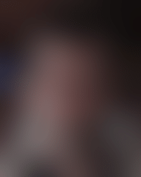

# Jupyter Notebook  template for preparing a research article for submission to the *Journal of Optical Communications and Networking*


<span style="color:green; font-size:17px">**AUTHOR ONE**</span> [<sup>1,2,3</sup>](#fn1 "footnote and tooltip 1").
<span style="color:green; font-size:17px">**AUTHOR TWO**</span> [<sup>2</sup>](#fn2)[<sup>(*)</sup>](#email).
<span style="color:green; font-size:17px">**AUTHOR THREE**</span> [<sup>3</sup>](#fn3).

<span id="fn1" style="font-size:13px"> 
    Publications Department, The Optical Society (OSA), 2010 Massachusetts Avenue NW, Washington D.C., 20036, USA
</span>

<span id="fn2" style="font-size:13px"> 
    School of Science, University of Technology, 2000 J St. NW, Washington DC, 20036, USA
</span>

<span id="fn3" style="font-size:13px"> 
    School of Optics, University of Technology, 2000 J St. NW, Washington DC, 20036, USA
</span>

<span id="email"> (*) Corresponding author: email@my-email.com</span>


<hr/>

**JOCN article style and format is being updated to conform to OSA journal style and format. This new template is now required for preparing a research article for submission to the *Journal of Optical Communications and Networking*. Consult the [OSA Author Style Guide](http://www.opticsinfobase.org/submit/style/) for general information about manuscript preparation. Please note that OSA is no longer using OCIS codes.**

<hr />


Introduction
============

This template is designed to assist with creating an article to submit
to the *Journal of Optical Communications and Networking*. See the OSA’s
[Style Guide](http://www.opticsinfobase.org/submit/style/) and
[Manuscript Templates](http://www.opticsinfobase.org/submit/templates/)
pages for more details.

If you have a question while using this template on [Overleaf]{}, please
use the help menu (“?”) on the top bar to search for help or ask us a
question using our [contact form](https://www.overleaf.com/contact).


# Examples of Article Components 


The sections below show examples of different article components.


Figures and Tables
==================


It is not necessary to place figures and tables at the back of the
manuscript. Figures and tables should be sized as they are to appear in
the final article. Do not include a separate list of figure captions and
table titles.

Figures and Tables should be labelled and referenced in the standard way
using the `\label{}` and `\ref{}` commands.


Sample Figure
-------------


Figure [1](#falsecolor) shows an example figure.


<figure id='falsecolor'>
   
    
   <figcaption style="text-align:center"> 
       <b> FIGURE 1 : </b>
       False-color image, where each pixel is assigned to one of seven reference spectra.
   </figcaption>
</figure>


Author Photographs
------------------

Author photographs. The final printed size of an author photograph is
exactly 1 inch wide by 1 1/4 inches long (6 picas × 7 1/2 picas). Please
ensure that the author photographs you submit are proportioned
similarly.

<!-- #region -->
## Sample Table


Table [1](#shapefunctions) shows an example table.
<!-- #endregion -->

  | local node |    $\{N\}_m$  |   $\{\Phi_i\}_m$ $(i=x,y,z)$|
  |------------| --------------| ----------------------------|
  |  $m = 1$   |  $L_1(2L_1-1)$|          $\Phi_{i1}$ |
  |  $m = 2$   |  $L_2(2L_2-1)$|          $\Phi_{i2}$ |
  |  $m = 3$   |  $L_3=4L_1L_2$|          $\Phi_{i3}$ |

<figure id='shapefunctions'>
   
    
   <figcaption style="text-align:center"> 
       <b> TABLE 1 : </b>
           Shape Functions for Quadratic Line Elements.
   </figcaption>
</figure>


Sample Equation
===============

Let $X_1, X_2, \ldots, X_n$ be a sequence of independent and identically
distributed random variables with $\text{E}[X_i] = \mu$ and
$\text{Var}[X_i] = \sigma^2 < \infty$, and let
$$S_n = \frac{X_1 + X_2 + \cdots + X_n}{n}
      = \frac{1}{n}\sum_{i}^{n} X_i
\label{eq:refname1}$$ denote their mean. Then as $n$ approaches
infinity, the random variables $\sqrt{n}(S_n - \mu)$ converge in
distribution to a normal $\mathcal{N}(0, \sigma^2)$.


# Sample Algorithm

Algorithms can be included using the commands as shown in algorithm [1](#euclid)


1. &nbsp; &nbsp; __Procedure__ EUCLID(a, b) &nbsp; &nbsp; &nbsp; The g.c.d. of a and b

2. &nbsp; &nbsp; $r\gets a\bmod b$ 

3. &nbsp; &nbsp; __while__ $r \neq 0$ __do__  &nbsp; &nbsp; &nbsp; We have the answer if r is 0
   
3. &nbsp; &nbsp; $a\gets b$ 
   
4. &nbsp; &nbsp; $b\gets r$ 
   
5. &nbsp; &nbsp; $r\gets a\bmod b$

6. &nbsp; &nbsp; __return__ $b$ &nbsp; &nbsp; &nbsp; The gcd is b

<figure id='euclid'>
   
   <figcaption style="text-align:center"> 
       <b> ALGORITHM 1 : </b>
           Euclid’s algorithm.
   </figcaption>
</figure>


Supplemental Material
=====================

Consult the Author Guidelines for Supplementary Materials in OSA
Journals for details on accepted types of materials and instructions on
how to cite them. All materials must be associated with a figure, table,
or equation or be referenced in the results section of the manuscript.
(1) 2D and 3D image files and video must be labeled “Visualization,” not
“Movie,” “Video,” “Figure,” etc. (2) Machine-readable data (for example,
csv files) must be labeled “Data File.” Number data files and
visualizations consecutively, e.g., “Visualization 1, Visualization 2….”
(3) Large datasets or code files must be placed in an open, archival
database. Such items should be mentioned in the text as either “Dataset”
or “Code,” as appropriate, and also be cited in the references list. For
example, “see Dataset 1 (Ref. \cite{FORSTER2007}) and Code 1 (Ref \cite{Chitimalla:17}]).” Here are
examples of the references


Sample Dataset Citation
-----------------------

1. M. Partridge, “Spectra evolution during coating,” figshare (2014) retrieved 13 May 2015 ,
http://dx.doi.org/10.6084/m9.figshare.1004612.


Sample Code Citation
--------------------

2. C. Rivers, “Epipy: Python tools for epidemiology,” (figshare, 2014) retrieved 13 May 2015,
http://dx.doi.org/10.6084/m9.figshare.1005064.


Funding and Acknowledgments
===========================

Formal funding sources should be listed in a separate paragraph block
before any other acknowledgment information. Funding sources and any
associated grant numbers should match the information entered into the
Prism manuscript system. Funders should be listed without any
introductory language or use of labels (do not use labels such as “grant
no.”). The acknowledgments may contain any information that is not
related to funding. Here is an example:

<!-- #region -->
Funding
=======

National Science Foundation (NSF) (1263236, 0968895, 1102301); The 863
Program (2013AA014402).

Acknowledgments 
===============


The authors thank H. Haase, C. Wiede, and J. Gabler for technical
support.
<!-- #endregion -->

References
==========

Full references (to aid the editor and reviewers) must be included. This
will be produced automatically if you are using a .bib file.

Add citations manually or use BibTeX. See \cite{FORSTER2007, Chitimalla:17} 


Author Biographies 
==================




**First A. Author** 

(M’76–SM’81–F’87) and the other authors may include
biographies at the end of regular papers. This author became a Member(M) of IEEE in 1976, a Senior Member (SM) in 1981, and a Fellow (F) in 1987. The first paragraph may contain a place and/or date of birth (list place, then date).
Next, the author’s educational background is listed. The degrees should be listed with type of degree in what field, which institution, city, state, and country, and year degree was earned. The author’s major field of study should be lower-cased.

The second paragraph uses the pronoun of the person (he or she) and not
the author’s last name. It lists military and work experience, including
summer and fellowship jobs. Job titles are capitalized. The current job
must have a location; previous positions may be listed without one.
Information concerning previous publications may be included. Try not to
list more than three books or published articles. The format for listing
publishers of a book within the biography is: title of book (city,
state: publisher name, year) similar to a reference. Current and
previous research interests end the paragraph.

The third paragraph begins with the author’s title and last name (e.g.,
Dr. Smith, Prof. Jones, Mr. Kajor, Ms. Hunter). List any memberships in
professional societies. Finally, list any awards and work for committees
and publications. If a photograph is provided, the biography will be
indented around it. The photograph is placed at the top left of the
biography. Personal hobbies will be deleted from the biography.


**Alice Smith** received her BSc (Mathematics) in 2000 from The
University of Maryland. Her research interests also include lasers and
optics.


# References

<mark> <b>The bib file /Users/bas/research/book_sprint/champs-booksprint-planning/convert_tex2html/article_test/sample.bib was not found

</b> </mark>(<a id="cit-FORSTER2007" href="#call-FORSTER2007">?</a>) !! _This reference was not found in /Users/bas/research/book_sprint/champs-booksprint-planning/convert_tex2html/article_test/sample.bib _ !!

(<a id="cit-Chitimalla:17" href="#call-Chitimalla:17">?</a>) !! _This reference was not found in /Users/bas/research/book_sprint/champs-booksprint-planning/convert_tex2html/article_test/sample.bib _ !!


```python
pwd
```
