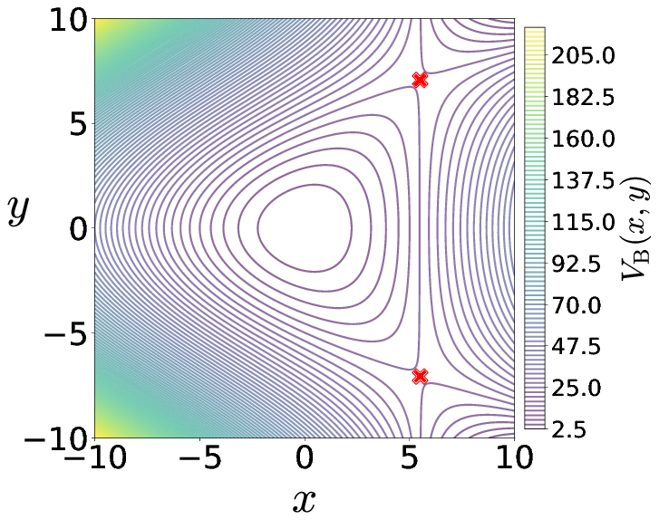
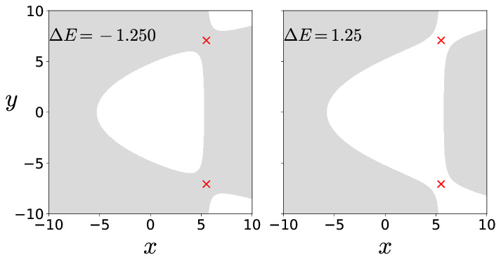
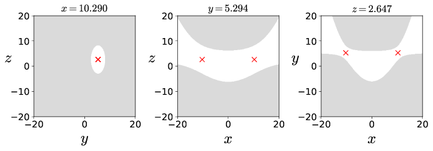
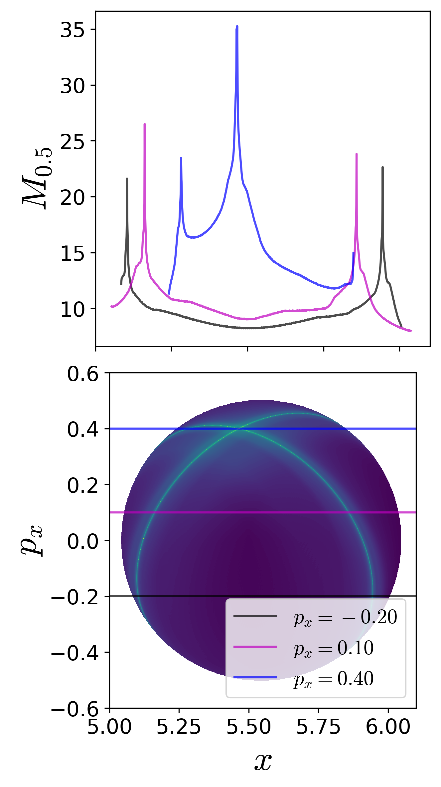
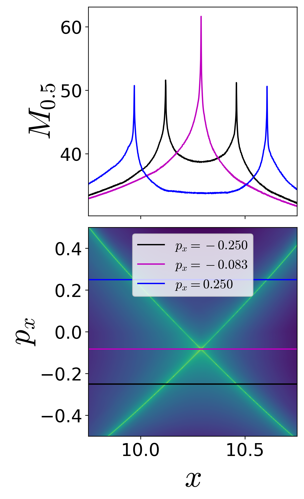
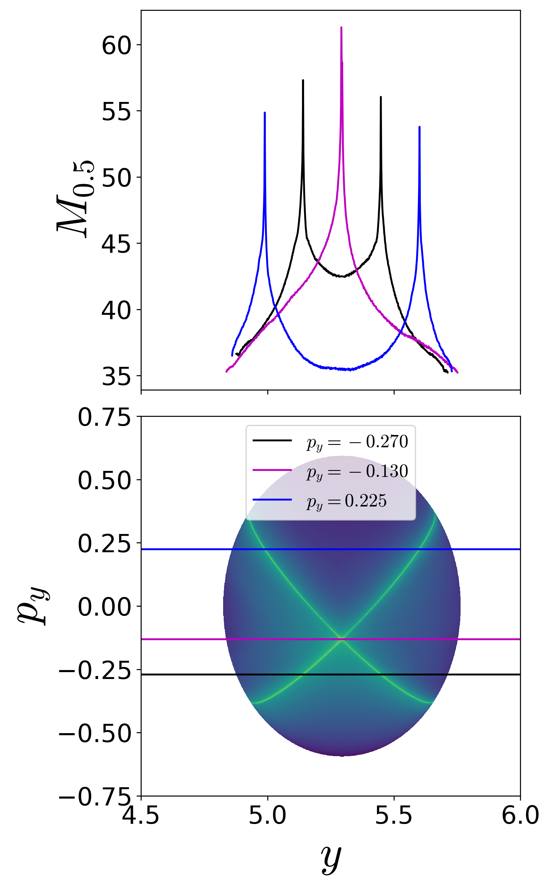

__Abstract__

We present the capability of Lagrangian descriptors for revealing the high 
dimensional phase space structures that are of interest in nonlinear Hamiltonian systems with index-1 saddle. These phase space structures include normally hyperbolic invariant manifolds (NHIM) and their stable and unstable manifolds, and act as codimenision-1 barriers to phase space transport. The method is applied to classical two and three degrees-of-freedom Hamiltonian systems which have implications for myriad applications in physics and chemistry.

## Introduction

It is well-known now that the paradigm of escape from a potential well
and the topology of phase space structures that mediate such escape are
used in a broad array of problems such as isomerization of molecular
clusters [@Komatsuzaki2001], reaction rates in chemical
physics [@Komatsuzaki1999; @WiWiJaUz2001], ionization of a hydrogen atom
under electromagnetic field in atomic physics [@JaFaUz2000], transport
of defects in solid state and semiconductor physics [@Eckhardt1995],
buckling modes in structural mechanics [@Collins2012; @ZhViRo2018], ship
motion and capsize [@Virgin1989; @ThDe1996; @NaRo2017], escape and
recapture of comets and asteroids in celestial
mechanics [@JaRoLoMaFaUz2002; @DeJuLoMaPaPrRoTh2005; @Ross2003], and
escape into inflation or re-collapse to singularity in
cosmology [@DeOliveira2002]. As such a method that can identify the high
dimensional phase space structures using low dimensional surface as
probes can aid in quantifying the escape rates. These low dimensional
surfaces has been shown to be of as *reactive islands* in chemical
physics and lead to insights into sampling rare transition
events [@patra_classical-quantum_2015; @patra_detecting_2018]. However,
to benchmark the methodology, we first applied it to linear systems
where the closed-form analytical expression of the phase space
structures is known [@naik2019finding]. As the next step, in this
article, we will focus on nonlinear Hamiltonian systems which have been
extensively studied as "built by hand" models of galactic dynamics and
for demonstrating quantum dynamical
tunneling [@barbanis_isolating_1966; @brumer_variational_1976; @davis_semiclassical_1979; @heller_molecular_1980; @waite_mode_1981; @kosloff_dynamical_1981; @contopoulos_simple_1985; @founargiotakis_periodic_1989; @barbanis_escape_1990; @babyuk_hydrodynamic_2003].
The nonlinear Hamiltonian systems considered here have an underlying
Hénon-Heiles type potential with the simplest form of nonlinearity, and
show regular, quasi-periodic, and chaotic trajectories along with
bifurcations of periodic orbits. A Hénon-Heiles type potential has a
well with bottlenecks connecting the region of bounded motion (trapped
region) to unbounded motion (escape off to infinity), and have
rotational symmetry. In addition, these Hénon-Heiles type potentials are
studied as first benchmark nonlinear systems in applying new phase space
transport methods to astrophysical and molecular motion. In this
article, we will present verification of a method that uses trajectory
diagnostic on a low dimensional surface for revealing the phase space
structures in 4 or more dimensions.

Conservative dynamics on an open potential well has received
considerable attention because the phase space structures, normally
hyperbolic invariant manifolds (NHIM) and its invariant manifolds,
explain the intricate fractal structure of ionization
rates [@mitchell_geometry_2003_I; @mitchell_geometry_2003_II; @mitchell_chaos-induced_2004].
Furthermore, the discrepancies in observed and predicted ionization
rates in atomic systems has also been explained by accounting for the
topology of the phase space structures. These have been connected with
the breakdown of ergodic assumption that is the basis for using
ionization and dissociation rate
formulae [@de_leon_intramolecular_1981]. This rich literature on chaotic
escape of electrons from atoms sets a precedent for applying new methods
for finding NHIM and its invariant manifolds in Hamiltonian with open
potential wells
 [@mitchell_analysis_2004; @mitchell_chaos-induced_2004; @mitchell_nonlinear_2009; @mitchell_structure_2007; @wang_photoionization_2010].

As we noted earlier, trajectory diagnostic methods which can probe phase
space to detect the high dimensional invariant manifolds have potential
to be of use in many degrees-of-freedom models. One such method is the
Lagrangian descriptors (LDs) that can reveal phase space structures by
encoding geometric property of trajectories (such as, phase space arc
length, configuration space distance or displacement, cumulative action
or kinetic energy) initialised on a two dimensional
surface [@madrid2009; @mendoza2010; @mancho2013; @lopesino2017]. The
method was originally developed in the context of Lagrangian transport
in time-dependent two dimensional fluid mechanics. However, it has also
been successful in locating transition state trajectory in chemical
reactions [@balibrea2016lagrangian; @craven2017lagrangian; @junginger2016lagrangian].
Besides, also being applicable to both Hamiltonian and non-Hamiltonian
systems, as well as to systems with arbitrary time-dependence such as
stochastic and dissipative forces, and geophysical data from satellite
and numerical
simulations [@amism11; @mendoza2014; @ggmwm15; @lopesino2017; @ramos2018].

The method of Lagrangian descriptor (LD) is straightforward to implement
computationally and it provides a "high resolution" method for exploring
the influence of high dimensional phase space structure on trajectory
behaviour. The method of LD takes an *opposite* approach to that of
classical Lyapunov exponent type calculations by emphasizing the initial
conditions of trajectories, rather than their advected locations that is
involved in calculating normalized rate of divergence. This is achieved
by considering a two dimensional section of the full phase space and
discretizing with a dense grid of initial conditions. Even though the
trajectories wander off in the phase space, as the initial conditions
evolve in time, there is no loss in resolution of the two dimensional
section. In contrast to inferring the phase space structures from
Poincaré sections, LD plots do not suffer from loss of resolution since
the affects of the structure are encoded in the initial conditions and
there is no need for the trajectory to return to the section. Our
objective is to clarify the use of Lagrangian descriptors as a
diagnostic on two dimensional sections of high dimensional phase space
structures. This diagnostic is also meant to be used as the preliminary
step in computing the NHIM, their stable and unstable manifolds using
other computational
means [@junginger2016transition; @bardakcioglu2018; @ezra_2018]. In this
article, we will present the method's capability to detect the high
dimensional phase space structures such as the NHIM, their stable, and
unstable manifolds in 2 and 3 DoF Hamiltonian systems.

## Models and Method

[\[sec:model\_prob\_2dof\]]{#sec:model_prob_2dof label="sec:model_prob_2dof"}Model system: coupled harmonic 2 DoF Hamiltonian
-----------------------------------------------------------------------------------------------------------------------------

As pointed out in the Introduction, our focus is to adopt a
well-understood model system which is a 2 degrees-of-freedom coupled
harmonic oscillator with the Hamiltonian $$\begin{aligned}
\mathcal{H}(x,y,p_x,p_y) =& T(p_x, p_y) + V_{\rm B}(x,y) \\ 
=& \frac{1}{2}p_x^2 + \frac{1}{2}p_y^2 + \frac{1}{2}\omega_x^2 x^2 + \frac{1}{2}\omega_y^2 y^2 +
\delta x y^2  
\end{aligned}
\label{eqn:Hamiltonian_Barbanis}$$ where $\omega_x, \omega_y, \delta$
are the harmonic oscillation frequencies of the $x$ and $y$
degree-of-freedom, and the coupling strength, respectively. We will fix
the parameters as $\omega_x 
= 1.0, \omega_y = 1.1, \delta = -0.11$ in this study. The two
degrees-of-freedom potential is also referred to as *Barbanis*
potential, and has been investigated as a model of galactic
motion ([@contopoulos1970; @barbanis_isolating_1966]), dynamical
tunneling and molecular spectra in physical
chemistry ([@heller1980; @davis1981; @martens1987]), structural
mechanics and ship capsize ([@ThDe1996; @NaRo2017]).

The equilibria of the Hamiltonian vector field are located at
$$\left(-\frac{\omega_y^2}{2\delta}, \pm 
\frac{1}{\sqrt{2}}\frac{\omega_x \omega_y}{\delta}, 0, 0 \right) \qquad \text{and}  \qquad \left(0, 
0, 0, 0 \right)$$ and are at total energy
$E_c = \frac{\omega_x^2 \omega_y^4}{8 \delta^2}$ and $0$ respectively.
The energy of the two index-1 saddles (as defined and shown in
App. [5.2.1](#ssect:linear){reference-type="ref"
reference="ssect:linear"}) located at positive and negative
y-coordinates and positive x-coordinate for $\delta < 0$ will be
referred to as *critical energy*, $E_c$. In our discussion, we will
refer to the total energy of a trajectory or initial condition in terms
of the excess energy, $\Delta E = E_c - e$, which can be negative or
positive to denote energy below or above the critical energy. For the
parameters used in this study, the index-1 saddle equilibrium points are
located at $\left( 5.5, \pm 7.071, 0, 
0 \right)$ and have energy, $E_c = 15.125$.

The contours of the coupled harmonic 2 DoF potential energy function in
 [\[eqn:Hamiltonian\_Barbanis\]](#eqn:Hamiltonian_Barbanis){reference-type="eqref"
reference="eqn:Hamiltonian_Barbanis"} is shown in
Fig. [\[fig:pes\_cont\_Barbanis\]](#fig:pes_cont_Barbanis){reference-type="ref"
reference="fig:pes_cont_Barbanis"} along with the 3D view of the
surface. We note here that the potential has steep walls for $x < 0$
when $\delta < 0$ and steep drop-off beyond the bottlenecks around the
index-1 saddles. This leads to unphysical motion in the sense of
trajectories approaching $-\infty$ with ever increasing acceleration
even for finite values of the configuration space
coordinates [@brumer_variational_1976].

In
Fig. [\[fig:hills\_region\_Barbanis\]](#fig:hills_region_Barbanis){reference-type="ref"
reference="fig:hills_region_Barbanis"} we show the *Hill's region*, as
defined in App. [5](#ssect:coupled_2dof){reference-type="ref"
reference="ssect:coupled_2dof"}, for the model
system [\[eqn:Hamiltonian\_Barbanis\]](#eqn:Hamiltonian_Barbanis){reference-type="eqref"
reference="eqn:Hamiltonian_Barbanis"}. It is important to note here that
even though Hill's region is shown on the configuration space, it
captures the dynamical picture, that is the *phase space perspective*,
of the Hamiltonian. This visualization of the energetically accessible
and forbidden realm is the first step towards introducing
two-dimensional surfaces to explore trajectory behavior. The complete
description of the unstable periodic orbit and its invariant manifolds
is described in App. [5.1](#ssect:tube_mani){reference-type="ref"
reference="ssect:tube_mani"} along with the visualization in the 3D
space.

{width="30.00000%"}\ {width="25.00000%"}\ {width="40.00000%"}

Fig. 1. (a) Potential energy function underlying the coupled harmonic Hamiltonian~\eqref{eqn:Hamiltonian_Barbanis} as isopotential contour and surface. The index-1 saddles are shown as red crosses in both the plots. (b) Hill's region for energy below and above the energy of the index-1 saddle. Parameters used are $\omega_x = 1.0, \omega_y = 1.1, \delta = -0.11$.

Since this model system is conservative 2 DoF Hamiltonian, that is the
phase space is $\mathbb{R}^4$, the energy surface is three dimensional,
the dividing surface is two dimensional, and the normally hyperbolic
invariant manifold (NHIM), referred to as the unstable periodic orbit,
is one dimensional [@wiggins_role_2016]. Now, if we consider the
intersection of a two dimensional surface with the three-dimensional
energy surface, we would obtain the one-dimensional energy boundary on
the surface of section. We will focus our study by using the
isoenergetic two-dimensional surface 

$$\begin{aligned}
%    U_{V, +} &= \left\{(y,p_y) \; | \; x = 0, \; p_x(y,p_y;e) > 0 \right\} , \qquad \text{motion 
%to the right}  \label{eqn:sos_U_Vp} \\
%    U_{V, -} &= \left\{(y,p_y) \; | \; x = 0, \; p_x(y,p_y;e) < 0 \right\} , \qquad \text{motion 
%to the left}  \label{eqn:sos_U_Vm} \\
    U_{xp_x, +} &= \left\{(x,y,p_x,p_y) \; | \; y = 0, \; p_y(x,y,p_x;e) > 0 \right\} 
    \label{eqn:sos_Uxpx} 
%    U_{H, -} &= \left\{(x,p_x) \; | \; y = 0, \; p_y(x,p_x;e) < 0 \right\} , \qquad \text{motion 
%to the bottom}  \label{eqn:sos_U_Hm}
\end{aligned}$$ 

where the sign of
the momentum coordinate enforces a directional crossing of the surface.
Due to the form of the vector
field [\[eqn:two\_dof\_Barbanis\]](#eqn:two_dof_Barbanis){reference-type="eqref"
reference="eqn:two_dof_Barbanis"} and choice of $\delta < 0$, this
directionality condition implies motion towards positive $y$-coordinate.

In this article, detecting the phase space structures will constitute
finding the intersection of the NHIM and its invariant manifolds with a
two dimensional surface (for example,
Eqn. [\[eqn:sos\_Uxpx\]](#eqn:sos_Uxpx){reference-type="eqref"
reference="eqn:sos_Uxpx"}).

### Model system: coupled harmonic 3 DoF Hamiltonian {#sec:model_prob_3dof}

The next higher dimensional model system to consider is the coupled
harmonic potential in 3 dimensions and underlying a 3 degrees-of-freedom
system in [@contopoulos_1994; @farantos_1998]. The Hamiltonian is given
by 

$$\begin{split}
\mathcal{H}(x,y,z,p_x,p_y,p_z) =  T(p_x, p_y, p_z) + V_{\rm BC}(x,y,z) = \frac{1}{2}p_x^2 + \frac{1}{2}p_y^2 + \frac{1}{2}p_z^2  + \frac{1}{2}\omega_x^2 x^2 + \frac{1}{2}\omega_y^2 y^2 + \frac{1}{2}\omega_z^2 z^2 - \epsilon x^2y - \eta x^2 z  
\label{eqn:Hamiltonian_BC_3dof}
\end{split}$$

where $\omega_x^2, \omega_y^2, \omega_z^2, \epsilon, \eta$ are the
parameters related to the coupled harmonic 3 dimensional potential
energy function [@farantos_1998]. In this study, we will fix the
parameters to be
$\omega_x^2 = 0.9, \omega_y^2 = 1.6, \omega_z^2 = 0.4, \epsilon = 
0.08, \eta = 0.01$. The two index-1 saddle equilibria (as shown in the
App. [6](#sect:coupled_3dof){reference-type="ref"
reference="sect:coupled_3dof"}) of the Hamiltonian vector
field [\[eqn:three\_dof\_Barbanis\]](#eqn:three_dof_Barbanis){reference-type="eqref"
reference="eqn:three_dof_Barbanis"} are located at 

$$\begin{equation}
\left(\pm \frac{\omega_x\omega_y\omega_z}{\sqrt{2(\epsilon^2\omega_z^2 + \eta^2\omega_y^2)}}, 
\frac{\epsilon \omega_x^2\omega_z^2}{2(\epsilon^2\omega_z^2 + \eta^2\omega_y^2)}, 
\frac{\eta \omega_x^2\omega_y^2}{2(\epsilon^2\omega_z^2 + \eta^2\omega_y^2)},  0, 0, 0 \right) 
\label{eqn:eq_pt_BC_3dof}
\end{equation}$$ 

and the total energy is
$$E_c = \frac{1}{8} \omega_x^2 \frac{\omega_x^2 \omega_y^2 \omega_z^2}{ \left( \epsilon^2 \omega_z^2 + \eta^2 \omega_y^2 \right)}.$$ 
The equilibrium point at
$(0,0,0,0,0,0)$ is stable and has total energy $0$. For the parameters
used in this study, the equilibrium points are located at
$\left( \pm 10.290, 5.294, 2.647, 
0, 0, 0 \right)$ and $\left( 0, 0, 0, 0, 0, 0 \right)$ and have total
energy, $E_c \approx 
23.824$ and $E = 0$, respectively.

We show the isopotential contours of the potential energy function at
fixed value of $z_{\rm eq}$ in
Fig. [\[fig:Barbanis\_Contopoulos\_3dof\]](#fig:Barbanis_Contopoulos_3dof){reference-type="ref"
reference="fig:Barbanis_Contopoulos_3dof"} along with the Hill's regions
for positive excess energy, $\Delta E = 6.000$ and projected on the
configuration space coordinates at the equilibrium point.

{width="25.00000%"}\ {width="70.00000%"}
[\[fig:Barbanis\_Contopoulos\_3dof\]]{#fig:Barbanis_Contopoulos_3dof
label="fig:Barbanis_Contopoulos_3dof"}

Fig. 2. (a) Potential energy function underlying the coupled harmonic Hamiltonian~\eqref{eqn:Hamiltonian_BC_3dof} at $z_{\rm eq} = 2.647$ as isopotential contour and surface. (b) Hill's region for excess energy, $\Delta E = 6.000$ and projected on the configuration space coordinates at the equilibrium point. We note here that the potential energy surface and the Hill's region is plotted by fixing one of the configuration coordinates at the equilibrium point.

Since this model system is conservative 3 DoF Hamiltonian, that is the
phase space is $\mathbb{R}^6$, the energy surface is five dimensional,
the dividing surface is four dimensional, and the normally hyperbolic
invariant manifold (NHIM) is three dimensional, or precisely 3-sphere,
and its invariant manifolds are four dimensional, or precisely
$\mathbb{R}^1 \times \mathbb{S}^3$ or *spherical
cylinders* [@wiggins_role_2016]. Now, if we consider the intersection of
a two-dimensional section with the five dimensional energy surface in
$\mathbb{R}^6$, we would obtain the one-dimensional energy boundary on
the surface. We will focus our study near the bottleneck by considering
the isoenergetic two dimensional surfaces

$$\begin{aligned}
    U_{xp_x}^+ = & \left\{ (x, y, z, p_x, p_y, p_z) \; | \; y = y_{\rm eq}, z = z_{\rm eq}, \; p_y = 0, \; p_z(x, y, z, p_x, p_y; e) > 0 \right\} \label{eqn:Barbanis3dof_uxpx}\\
    U_{yp_y}^+ = & \left\{ (x, y, z, p_x, p_y, p_z) \; | \; x = x_{\rm eq}, z = z_{\rm eq}, \; p_x = 0, \; p_z(x, y, z, p_x, p_y; e) > 0 \right\} \label{eqn:Barbanis3dof_uypy}\\
    U_{zp_z}^+ = & \left\{ (x, y, z, p_x, p_y, p_z) \; | \; x = x_{\rm eq}, y = y_{\rm eq}, \; p_x = 0, \; p_y(x, y, z, p_x, p_z; e) > 0 \right\} \label{eqn:Barbanis3dof_uzpz}
%   \label{eqn:Barbanis3dof_sos_near_saddle}
\end{aligned}$$

In this 3 DoF system, detecting points on the three dimensional NHIM and
four dimensional invariant manifolds will constitute finding their
intersection with the above two dimensional surfaces.

## Method: Lagrangian descriptor

The Lagrangian descriptor (LD) as presented in Ref.[@madrid2009] is the
arc length of a trajectory calculated on a chosen initial time $t_0$ and
measured for fixed forward and backward integration time, $\tau$. For
continuous time dynamical systems, Ref.[@lopesino2017] gives an
alternative definition of the LD which is useful for proving rigorous
results and can be computed along with the trajectory. It provides a
characterization of the notion of singular features of the LD that
facilitates a proof for detecting invariant manifolds in certain model
situations. In addition, the "additive nature" of this new definition of
LD provides an approach for assessing the influence of each
degree-of-freedom separately. This property was used in
Ref.[@demian2017] to show that Lagrangian descriptor can detect Lyapunov
periodic orbits in the two degrees-of-freedom Hénon-Heiles system. We
will adopt a similar strategy for the aforementioned two and three
degrees-of-freedom autonomous Hénon-Heiles type systems.

In the general setting of a time-dependent vector field
$$\frac{d\mathbf{x}}{dt} = \mathbf{v}(\mathbf{x},t), \quad \mathbf{x} \in \mathbb{R}^n \;,\; t \in 
\mathbb{R}$$ where $\mathbf{v}(\mathbf{x},t) \in C^r$ ($r \geq 1$) in
$\mathbf{x}$ and continuous in time. The definition of LDs depends on
the initial condition $\mathbf{x}_{0} = \mathbf{x}(t_0)$, on the initial
time $t_0$ (trivial for autonomous systems) and the integration time
$\tau$, and the type of norm of the trajectory's components, and takes
the form,

$$M_p(\mathbf{x}_{0},t_0,\tau) = \displaystyle{\int^{t_0+\tau}_{t_0-\tau} \sum_{i=1}^{n} 
|\dot{x}_{i}(t;\mathbf{x}_{0})|^p \; dt}
\label{eqn:M_function}$$

where $p \in (0,1]$ and $\tau \in \mathbb{R}^{+}$ are freely chosen
parameters, and the overdot symbol represents the derivative with
respect to time. It is to be noted here that there are three
formulations of the function $M_p$ in the literature: the arc length of
a trajectory in phase space [@madrid2009], the arc length of a
trajectory projected on the configuration
space  [@junginger2016transition; @junginger2016uncovering; @junginger2017chemical; @junginger2017variational],
and the sum of the $p$-norm of the vector field
components [@lopesino_2015; @lopesino2017]. Although the latter
formulation of the Lagrangian
descriptor [\[eqn:M\_function\]](#eqn:M_function){reference-type="eqref"
reference="eqn:M_function"} developed in
Ref. [@lopesino_2015; @lopesino2017] does not resemble the arc length,
the numerical results using either of these forms have been shown to be
in agreement and promise of predictive capability in geophysical
flows [@amism11; @mendoza2014; @ggmwm15; @ramos2018]. The formulation we
adopt here is motivated by the fact that this allows for proving
rigorous result, which we will discuss in the next section, connecting
the singular features and minimum in the LD plots with NHIM and its
stable and unstable manifolds. It follows from the result that

$$\begin{aligned}
\mathcal{W}^s(\mathbf{x}_0, t_0) & = \text{\rm argmin} \; \mathcal{L}^{(f)}(\mathbf{x}_0, t_0, 
\tau) \\
\mathcal{W}^u(\mathbf{x}_0, t_0) & = \text{\rm argmin} \; \mathcal{L}^{(b)}(\mathbf{x}_0, t_0, \tau)
\end{aligned}$$

where the stable and unstable manifolds
($\mathcal{W}^s(\mathbf{x}_0, t_0)$ and $\mathcal{W}^u(\mathbf{x}_0, t_0)$) denote the invariant manifolds at
intial time $t_0$ and $\text{\rm argmin} \; (\cdot)$ denotes the
argument that minimizes the function
$\mathcal{L}^{(\cdot)}(\mathbf{x}_0, t_0, \tau)$ in forward and backward
time, respectively. In addition, the coordinates on the NHIM,
$\mathcal{M}(\mathbf{x}_0, t_0)$ at time $t_0$ is given by the
intersection $\mathcal{W}^s(\mathbf{x}_0, t_0)$ and
$\mathcal{W}^u(\mathbf{x}_0, t_0)$ of the stable and unstable manifolds,
and thus given by 

$$\begin{aligned}
\mathcal{M}(\mathbf{x}_0, t_0) & = \text{\rm argmin} \; \left( \mathcal{L}^{(f)}(\mathbf{x}_0, t_0, 
\tau) + \mathcal{L}^{(b)}(\mathbf{x}_0, t_0, \tau) \right) \\
& = \text{\rm argmin} \; 
\mathcal{L}(\mathbf{x}_0, t_0, \tau) 
\end{aligned}$$

In applying the LD method to nonlinear systems, one observes multiple
minima and singularities that can lead to trouble with isolating the one
minima due to the NHIM and the ones due to its invariant manifolds.
Since, as we integrate initial conditions on an isoenergetic two
dimensional surface such as
$U_{xp_x}^+$ [\[eqn:sos\_Uxpx\]](#eqn:sos_Uxpx){reference-type="eqref"
reference="eqn:sos_Uxpx"}, almost all trajectories that escape to
infinity get integrated for the entire time interval and result in
numerical overflow of the function M
value [\[eqn:M\_function\]](#eqn:M_function){reference-type="eqref"
reference="eqn:M_function"} and show up as NaN. This can, however, be
avoided by integrating for shorter time interval but this will vary for
different locations of a surface. Thus, leading to trouble in locating
the point with minimum and singularity in LD contour map that correspond
to NHIM and its invariant manifolds.

This computational issue has been addressed in recent efforts to locate
transition state trajectory in driven and 3 degrees-of-freedom chemical
reaction
dynamics [@craven2017lagrangian; @craven2016deconstructing; @craven2015lagrangian].
It has been noted that computing fixed integration time Lagrangian
descriptor (LD) leads to two potential issues:

1\. Bounded trajectories will show global recrossings of the barrier as
predicted by Poincaré recurrrence theorem. The recrossings will show
multiple minima and singularities (as in
Fig. [\[fig:psect\_lag\_desc\_Barbanis\]](#fig:psect_lag_desc_Barbanis){reference-type="ref"
reference="fig:psect_lag_desc_Barbanis"}(d-f)) in the LD plot which
obscures locating the actual NHIM.

2\. The trajectories that escape the potential well will leave with ever
increasing acceleration, if the potential energy surface opens out to
infinity. The trajectories with NaN LD values will render the contour
map flat which again obscures locating the NHIM.

To circumvent these issues, a heuristic that has been adopted in the
literature is to calculate LD values only until a trajectory remains
inside the barrier region. The immediate result is the initial condition
on an invariant manifold will have a maxima in the LD values because of
being integrated for the full integration time (preselected) interval.

Thus, the
formulation [\[eqn:M\_function\]](#eqn:M_function){reference-type="eqref"
reference="eqn:M_function"} is modified as

$$M_p(\mathbf{x}_{0},t_0,\tau^{\pm}) = \displaystyle{\int^{t_0+\tau^+}_{t_0-\tau^-} \sum_{i=1}^{n} 
    |\dot{x}_{i}(t;\mathbf{x}_{0})|^p \; dt}
\label{eqn:M_function_var}$$ 

where the integration time interval depends on a trajectory and given by

$$\tau^{\pm}(\mathbf{x}_0) = \min\left(\tau, t\vert_{|\mathbf{x}(t)| > q_s} \right)
\label{eqn:var_time_qs}$$ 

where $q_s$ defines a domain, called the
*saddle region*, in the configuration space around the saddle. We note
here that the only initial condition that gets integrated for the
entrire $\tau$ time units in forward and backward time is the one on the
NHIM. In addition, the coordinates on the NHIM,
$\mathcal{M}(\mathbf{x}_0, t_0)$, at time $t_0$ is given by
$$\begin{aligned}
\mathcal{M}(\mathbf{x}_0, t_0) & = \text{\rm argmax} \; \left( \mathcal{L}^{(f)}(\mathbf{x}_0, t_0, 
\tau) + \mathcal{L}^{(b)}(\mathbf{x}_0, t_0, \tau) \right) \\
& = \text{\rm argmax} \; \mathcal{L}(\mathbf{x}_0, t_0, \tau) 
\end{aligned}$$ This is also a familiar from a dynamical systems
perspective where the literature on average exit times to locate
invariant sets has been discussed for the symplectic maps
(see [@meiss_average_1997] and related references). However, the
connection between features in exit times and LD contour maps is not the
focus of this study and will be deferred as related future work.

## Results

We begin by noting that two-dimensional Poincaré surface of section have
sufficient dimensionality to capture trajectories on a three dimensional
energy surface, however for high dimensional systems trajectories can go
"around" the two dimensional surface. One approach available in the
literature is to use high dimensional Poincaré sections which can
"catch" trajectories but are hard to visualize on paper or in the
virtual 3D space. Even when gets around this issue, using suitable
projective geometry, the fact that the qualitative analysis based on
Poincaré sections depends on trajectories returning to this surface can
not be circumvented since trajectories on and inside the spherical
cylinders will not return to the Poincaré surface of section.

{width="80.00000%"} 
{width="80.00000%"}

Fig. 3. __Top row:__ Poincar\'e surface of section, $U_{xp_x}$~\eqref{eqn:sos_Uxpx}, at excess energy (a) $\Delta E = -0.125$, (b) $\Delta E = 0.000$, (c) $\Delta E = 0.125$ where the intersection of the surface of section with the energy surface is shown in green. __Bottom row:__ Lagrangian descriptor on the surface of section, $U_{xp_x}$~\eqref{eqn:sos_Uxpx}, for the excess energies (d) $\Delta E = -0.125$, (e) $\Delta E = 0.000$, (f) $\Delta E = 0.125$ and the integration time $\tau = 50$. The intersection of the surface of section with the cylindrical manifolds of the NHIM \textemdash unstable periodic orbit for this system \textemdash associated with the index-1 saddle equilibrium point in the bottleneck is shown in cyan (stable) and magenta (unstable) curves. The magenta and cyan curves in $p_x > 0$ correspond to the invariant manifolds of unstable periodic orbit at $y > 0$ index-1 saddle, and the ones in $p_x < 0$ correspnd to the invariant manifolds of unstable periodic orbit at $y < 0$ index-1 saddle.

Coupled harmonic 2 DoF system
-----------------------------

As discussed in aforementioned
literature [@madrid2009; @lopesino2017; @demian2017], points with
minimum Lagrangian descriptor (LD) values and singularity are on the
invariant manifolds. In addition, LD plots show dynamical correspondence
with Poincaré sections (in the sense that regions with regular and
chaotic dynamics are distinct in both Poincaré section and LD plots)
while also depicting the geometry of manifold
intersections [@demian2017; @lopesino2017; @garcia-garrido_2018]. This
correspondence in the LD features and Poincaré section is confirmed in
Fig. [\[fig:psect\_lag\_desc\_Barbanis\]](#fig:psect_lag_desc_Barbanis){reference-type="ref"
reference="fig:psect_lag_desc_Barbanis"} where we show the Poincaré
surface of section
Eqn. [\[eqn:sos\_Uxpx\]](#eqn:sos_Uxpx){reference-type="eqref"
reference="eqn:sos_Uxpx"} of trajectories and LD contour maps on the
same isoenergetic two-dimensional surface for negative and positive
excess energies. It can be seen that the chaotic dynamics as marked by
the sea of points in Poincaré section is revealed as the tangle of
invariant manifolds which are points of minima and singularity in the LD
plots. As shown by the one dimensional slices of the LD plots, there are
multiple such minima and singularities and as the excess energy is
increased to positive values, there are regions of discontinuities along
the one dimensional slice. Next, as the energy is increased and the
bottleneck opens at critical energy $E_c$, trajectories that leave the
potential well and do not return to the surface of section are not
observed on the Poincaré section while the LD contour maps clearly
identifies these regions as discontinuities in the LD values. These
regions lead to escape because they are inside the cylindrical manifolds
of the unstable periodic orbit associated with the index-1 saddle
equilibrium point [@NaRo2017]. These regions on the isoenergetic
two-dimensional surface are also referred to as *reactive islands* in
chemical reaction dynamics [@DeLeon1992; @DeMeTo1991; @DeMeTo1991a]. The
escape regions or reactive islands that appear over the integration time
interval can also be identified by using the forward and backward LD
contour maps where these regions appear as discontinuities. In
Fig. [\[fig:psect\_lag\_desc\_Barbanis\]](#fig:psect_lag_desc_Barbanis){reference-type="ref"
reference="fig:psect_lag_desc_Barbanis"}(f), we show these for
$\Delta E = 
0.125$ and $\tau = 50$ along with the intersection of the cylindrical
manifolds' intersections that are computed using differential correction
and numerical continuation. The detailed comparison and extension to
high dimensional systems is not the focus of this study and will be
discussed in forthcoming work. Thus LD maps also provide a quick and
reliable approach for detecting regions that will lead to escape within
the observed time, or in the computational context, the integration
time.

To detect the NHIM  in this case, unstable periodic orbit  associated
with the index-1 saddles (marked by cross in
Fig. [\[fig:pes\_cont\_Barbanis\]](#fig:pes_cont_Barbanis){reference-type="ref"
reference="fig:pes_cont_Barbanis"}), we define an isoenergetic two
dimensional surface that is parametrized by the $y$-coordinate and
placed near the $x$-coordinate of the saddle equilibrium that has the
negative $y$-coordinate. This can be expressed as a parametric two
dimensional surface 

$$\begin{aligned}
%  U_{xy}^+ = & \left\{(x,y,p_x,p_y) \; | \; p_x = 0, \; p_y(x,y;e) > 0 \right\}, \\
U_{xp_x}^+(k) = & \left\{(x,y,p_x,p_y) \, | \, y = k, p_y(x,y,p_x;e) > 0 \right\} 
\label{eqn:sos_xpx_k}
%  U_{yp_y}^+ = & \left\{(x,y,p_x,p_y) \; | \; x = k_x, \; p_y(x,y,p_x;e) > 0 \right\},
\end{aligned}$$

for total energy, $e$, which is above the critical energy, $E_c$, $k$ is
the $y$-coordinate. The variable integration time LD contour maps are
shown in
Fig. [\[fig:Barbanis2dof\_M1500x1500\_E15-250\]](#fig:Barbanis2dof_M1500x1500_E15-250){reference-type="ref"
reference="fig:Barbanis2dof_M1500x1500_E15-250"} along with the
projection of the low dimensional
slices [\[eqn:sos\_xpx\_k\]](#eqn:sos_xpx_k){reference-type="eqref"
reference="eqn:sos_xpx_k"} in the configuration space and the NHIM. The
points on NHIM, which is an unstable periodic orbit for 2 DoF, on this
surface is the coordinate with maximum (for variable integration time)
LD value. The full visualization of the NHIM as the black ellipse,
$\mathbb{S}^1$, is in
Fig. [\[fig:Barbanis2dof\_M1500x1500\_E15-250\]](#fig:Barbanis2dof_M1500x1500_E15-250){reference-type="ref"
reference="fig:Barbanis2dof_M1500x1500_E15-250"}(d) and has been
computed using differential correction and numerical continuation
(details in App. [5.1](#ssect:tube_mani){reference-type="ref"
reference="ssect:tube_mani"}) and shows clearly that points on this
unstable periodic orbit are detected by the LD contour map.

{width="24.00000%"}\ {width="24.00000%"}\ {width="24.00000%"}\ {width="24.00000%"}

Fig. 4. Lagrangian descriptor computed for variable integration time on two dimensional slices~\eqref{eqn:sos_xpx_k} near the bottleneck that detect the NHIM and its invariant manifolds associated with the index-1 saddle. The two dimensional surfaces are shown in the top figure in (d) projected as orange lines on the configuration space and the unstable periodic orbit as black line connecting the isopotential contour corresponding to $\Delta E = 0.125$ with the Hill's region shown in grey. The two dimensional slices represent low dimensional probe of the unstable periodic orbit and the movie of a rotating view can be found [here](https://youtu.be/Ai65ULLlljc).

### Coupled harmonic 3 DoF system

The Lagrangian descriptor based approach for detecting NHIM in 2 DoF
system can now be applied to the 3 DoF
system [\[eqn:Hamiltonian\_BC\_3dof\]](#eqn:Hamiltonian_BC_3dof){reference-type="eqref"
reference="eqn:Hamiltonian_BC_3dof"}. On the five dimensional energy
surface, the phase space structures such as the NHIM and its invariant
manifolds are three and four dimensional,
respectively [@wiggins_role_2016]. As noted earlier, direct
visualization techniques will fall short in 4 or more DoF systems even
if they are successful in 2 and 3 DoF. So, LD based approach can be used
to detect points on a NHIM and its invariant manifolds using low
dimensional probe which are based on trajectory diagnostic on an
isoenergetic two dimensional surface.

It is to be noted that the increase in phase space dimension, leads to a
polynomial scaling in the number of coordinate pairs (that is
$2N(2N-1)(N-1)$ coordinate pairs for $N$ DoF system) and is thus,
impractical to present the procedure on all the combination of
coordinates. We will present the results for the three configuration
space coordinates by combining each with its corresponding momentum
coordinate.

On these isoenergetic surfaces, we compute the variable integration time
Lagrangian descriptor for small excess energy, $\Delta E \approx 0.176$,
or total energy $E = 24.000$, and show the contour maps in
Fig. [\[fig:Barbanis3dof\_M\_pxpypz\]](#fig:Barbanis3dof_M_pxpypz){reference-type="ref"
reference="fig:Barbanis3dof_M_pxpypz"}. The maxima identifying the
points on the NHIM and its invariant manifolds can be visualized using
one dimensional slices for constant momenta. This indicates clearly the
initial conditions in the phase space (points on the isoenergetic two
dimensional surfaces in $\mathbb{R}^6$, for
example [\[eqn:Barbanis3dof\_uxpx\]](#eqn:Barbanis3dof_uxpx){reference-type="eqref"
reference="eqn:Barbanis3dof_uxpx"}) that do not leave the saddle region.

{width="33.00000%"}\ {width="33.00000%"}\ {width="33.00000%"}
Fig. 5. Detecting points on the NHIM using variable integration time Lagrangian descriptor on the two dimensional surfaces (a) $U_{xp_x}^+$~\eqref{eqn:Barbanis3dof_uxpx}, (b) $U_{yp_y}^+$~\eqref{eqn:Barbanis3dof_uypy}, and (c) $U_{zp_z}^+$~\eqref{eqn:Barbanis3dof_uzpz} at excess energy $\Delta E \approx 0.176$ or total energy $E = 24.000$. For this energy value, the saddle region, as defined in Eqn.~\eqref{eqn:var_time_qs}, is taken to be $q_s = [9,12] \times [2.5,7.5] \times [1,4]$ and $\tau = 50$.

## Conclusions

In this article, we discussed a trajectory diagnostic method as a low
dimensional probe of high dimensional invariant manifolds in 2 and 3 DoF
nonlinear Hamiltonian systems. This trajectory diagnostic --- Lagrangian
descriptor (LD) --- can represent a geometric property of interest in a
system with escape/transition and features, that is minima or maxima, in
its contour map identify points on the high dimensional invariant
manifolds.

Comparing the points on the NHIM in 2 DoF system obtained using the LD
method with differential correction and numerical continuation, we also
verified the method for a nonlinear autonomous system following our
previous work on decoupled and coupled 2 and 3 DoF linear
system [@naik2019finding]. The results on 3 DoF system are also
congruent with what one expects for an extended problem of the 2 DoF
coupled harmonic potential. In addition, the LD method based detection
of NHIM is simple to implement and quickly provides a lay of the
dynamical land which is a preliminirary step in applying phase space
transport to problems in physics and chemistry. This method can also be
used to set up starting guess for other numerical procedures which rely
on good initial guess or can also be used in conjunction with machine
learning methods for rendering the smooth pieces of
NHIM [@bardakcioglu2018; @feldmaier_invariant_2019].

## Acknowledgements

We acknowledge the support of EPSRC Grant No.  EP/P021123/1 and ONR
Grant No. N00014-01-1-0769. We would like to thank Dmitry Zhdanov for
stimulating discussions.

