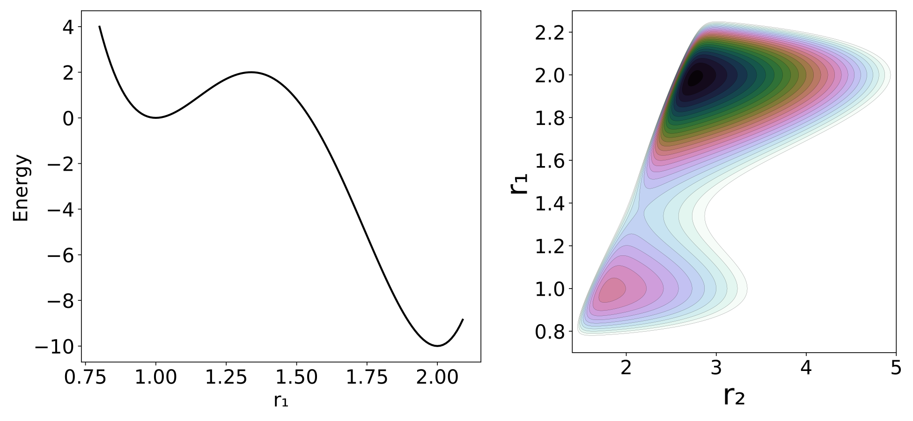

<!-- #region -->
Our model potential (see [Figure here](#ModelFig)) consists of a one-dimensional double well oscillator that represents the reactive system, coupled to a one-dimensional harmonic oscillator representing the bath. The only coupling between the two oscillators is a Lennard-Jones-like repulsion potential term. Consequently, this model is appropriate only for nonpolar systems; our concern here is the consequence of non-bonded interactions between solvent and solute, not the more commonly studied polar interactions.

where the subscripts 1 and 2 refer to the reactive system and bath oscillators respectively; $r=(r_1,r_2 )$ is the position of the two oscillators and $p=(p_1,p_2 )$ represents the conjugate momenta. The reduced mass of each oscillator is represented by $\mu$, and c are coefficients whose values are listed in [Figure here](#ModelFig). The potential energy can be divided between $\sum_{j=1}^{5} c_j r_1^{j-1}$ as the potential of the reactive system, $V_2=c_6 (c_7-r_2 )^2$ as the potential of the bath and $V_{int}=c_8⁄(r_2-r_1 )^{-12}$ as the interaction between the two; hence $V=V_1+V_1+V_{int}$. The potential of the reactant, shown in [Figure here](#PESFig), is chosen to have a minimum at $r_1=1.0$ and a second one at $r_1=2.0$ , with respective potential energies $V_1=0.0$ and $V_1=-10$. The maximum energy is at $r_1=1.33867$ and $V_1=2.0$. The full potential, shown in [Figure here](#PESFig), has a saddle point at $r_1=1.36561$ and $r_2=2.161769$ at $V=3.47291$. The "reactant" minimum occurs at $r_1 = 0.98779$, $r_2 = 1.80661$, $V = 0.77040$. The "product" minimum occurs at $r_1 = 1.98517$, $r_2 = 2.75642$, $V = -6.66284$.

In [Figure here](#DSCloseFig) (top) we can see the projection of the calculated PODSs in configuration space. [Figure here](#DSCloseFig) also includes two approximations to the DS explained in the caption and shows how the three of them respond as $\mu_2$ changes. It can be seen that, for low reduced masses, the approximate DSs are close to the PODS. That is because the bath can rapidly adapt to the position of the reactive system. However, as $\mu_2$ increases the PODS starts to curve and to displace from the approximate DSs, moving closer to the product well.
The geometry of this one parameter family of circles depends on the nature of the projection of the PO into configuration space. In this particular case the PO projections are arcs where a configuration space point on the projection of the PO moves back and forth along the arc. This means that the endpoints of the arc are turning points with $p_x=p_y=0$, where the circles defined by eq. \eqref{DSGeomEq} shrink to points. This implies that the geometry of the one parameter family of circles defines a 2D sphere (see [Figure here](#DSCloseFig) bottom).
![(Top)Close-up of the PES of the full system, near the saddle point region at different reduced masses of the bath. Each of the axis scales were weighted by the square root of its coordinate mass. The dashed red line is the intrinsic reaction coordinate (IRC). The blue line is DS if one assumes that the reaction coordinate is $r_1$. The red line is the DS projection at the saddle point, which is locally orthogonal to the IRC (It does not look orthogonal because of the choice of axis scales). The green line is the projection of the PO that defines the Dividing surface. (Bottom) Schematic representation of the DS's geometrical structure for the different reduced masses. The yellow structure represents the possible momenta depending of the location in the DS.](PODS_DSshape.png)

From the sampled trajectories we can measure the time taken to reach a determined region (transit time), in this case the PES minimum identified as the product well. Then we can perform the same calculation but with trajectories starting on the DS defined only with $r_1$ (the blue line in [Figure here](#DSCloseFig)). The blue line corresponds to the common choice for solution phase reactions of assigning the transition state location to the PES saddle point, and assuming that the reaction coordinate is entirely determined by the solute. [Figure here](#TransitFig) is a representation in phase space of the transit times of trajectories that start on the true and approximate dividing surfaces with different initial $p_\perp$, the momentum normal to the dividing surface. The transit times (calculated as the time for $r_1$ to reach a value greater than that for product minimum) show brighter colors in Figure [Figure here](#TransitFig) as the transit time increases. The expected results for a DS is that trajectories starting with negative momenta normal to the dividing surface ($p_\perp<0$), i.e. directed to the reactant well, would take longer to reach the product well than those that start with positive momenta. This is clearly the case for the PODS as can be seen in Figure 6, where $p_\perp=0$ (which corresponds to the PO) provides an exact line of demarcation in the transit times. By contrast, the approximate DS shows long and short transit times on both sides of $p_1=0$. It is interesting to note that those areas where the transit times are long for $p_1>0$ or short for $p_1<0$ correspond to recrossing of trajectories, and that the amount of recrossing gets larger as $\mu_2$ increases. Thus, the approximate DS becomes a poorer and poorer choice for the transition state as the mass of the bath oscillator increases.

) and (Bottom) the DS conventional definition of the TS (blue DS in [Figure here](#DSCloseFig)). The color scale goes from dark colors for short times to brighter colors for long times. The quantity $p_\perp$ is the momentum perpendicular to the dividing surface, with a positive sign being in the direction of the product.](TransitT.png){#fig:TransitFig width=100%}

The brighter colored bands visible on the reactant sides ($p_\perp <0$) in Figure [Figure here](#TransitFig) are associated with the many periodic orbits located in the reactant well. Trajectories that approach these POs can spend a long time before finally crossing over to the product well.
<!-- #endregion -->
