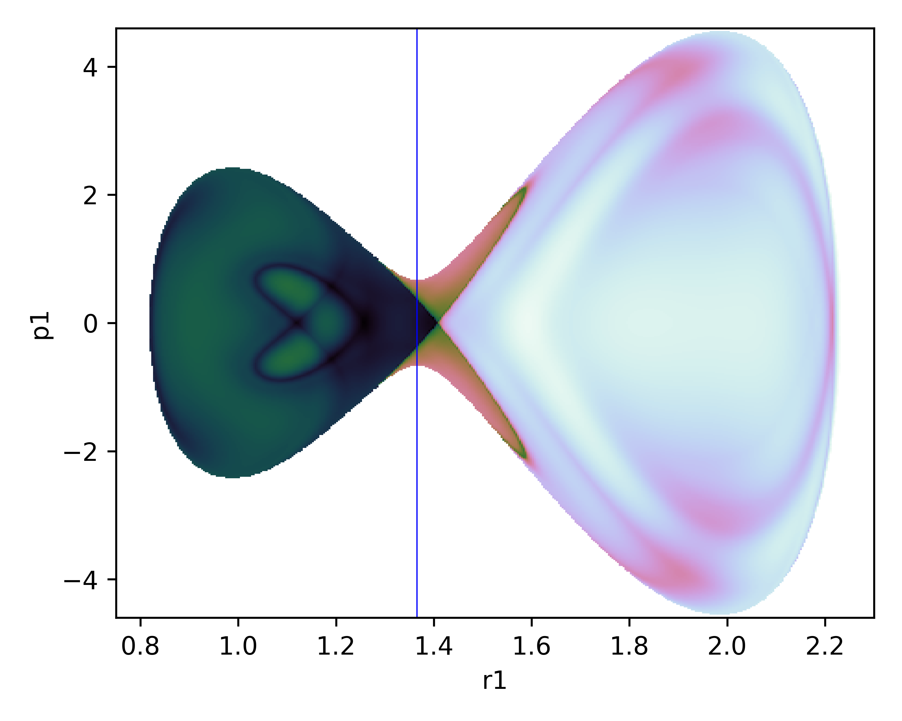

# Introduction

Finding the location of the Dividing Surface (DS) in chemical reactions has been the focus of many theoretical studies both in solution and in vacuum. [@RN5366] This surface is characterized as a hypersurface that divides the reactants and product areas and that once being crossed by a trajectory it will not recross it again before being thermalized in the reactant or product well depending from where it came. The importance of this surface is based in the application of Transition State Theory which calculates the rate constant as the flux of trajectories going through it. [EurJOC2018] One of the strong points of TST is that, once we find the DS, the theory gives perfectly accurate result (without taking into account any error introduced by the model we are using to represent the real process). Of course finding such a surface is not an easy task and could even be technically impossible for reactions in solutions.

Colons can be used to align columns.

| Tables        | Are           | Cool  |
| ------------- |:-------------:| -----:|
| col 3 is      | right-aligned | $1600 |
| col 2 is      | centered      |   $12 |
| zebra stripes | are neat      |    $1 |

There must be at least 3 dashes separating each header cell.
The outer pipes (|) are optional, and you don't need to make the 
raw Markdown line up prettily. You can also use inline Markdown.

Markdown | Less | Pretty
--- | --- | ---
*Still* | `renders` | **nicely**
1 | 2 | 3

